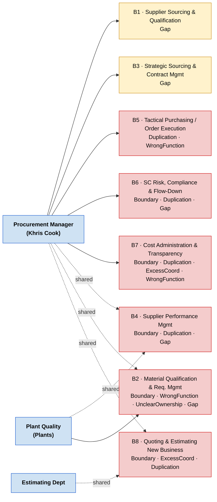
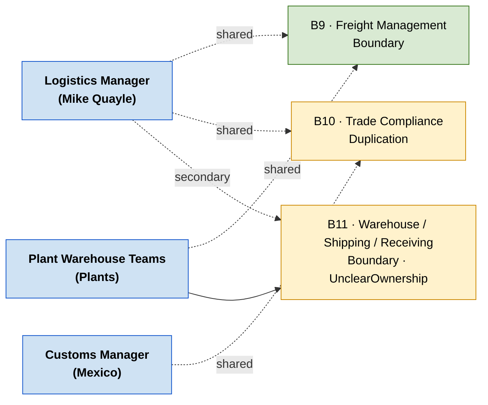
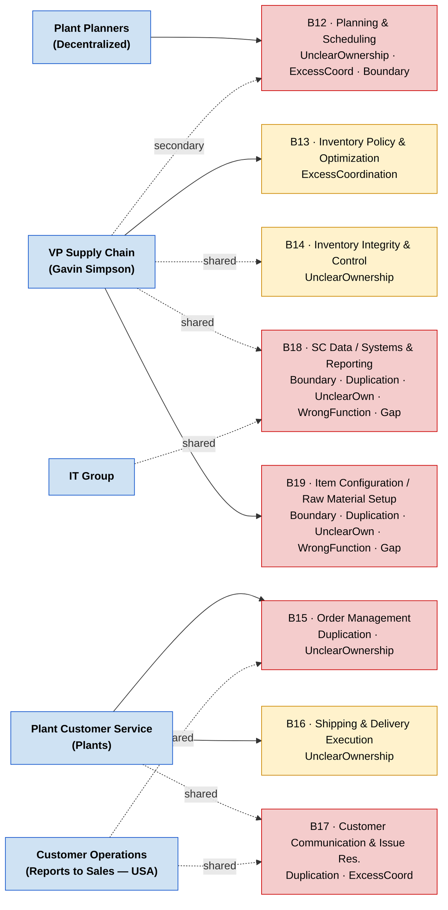
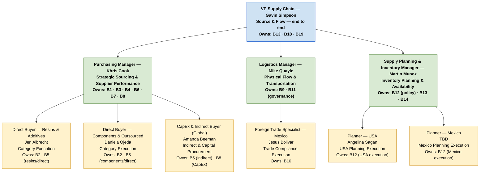

# Current State → Future State: Supply Chain Work Bucket Map

> Source documents: [`workshop-project (1).md`](../workshop-project%20(1).md) · [`data/work-bucket-map.csv`](../data/work-bucket-map.csv)
> Flag definitions: [`flag-definitions.md`](flag-definitions.md)

---

## Current State

19 work buckets span 5 functional pillars. Ownership is heavily concentrated in the Procurement Manager, planning has been decentralized without central governance, and most buckets carry significant structural flags.

**Flag color key:**
- 🔴 **Red** = 3 or more flags, or critical ownership issues (WrongFunction / UnclearOwnership combinations)
- 🟡 **Yellow** = 1–2 moderate flags
- 🟢 **Green** = 0–1 minor flags

### Purchasing Pillar

### Logistics Pillar

### Planning & Inventory, Customer Service, and Cross / VP-Level Pillars

### Current State Issues at a Glance

| Pillar | Buckets | Buckets with 🔴 High Flags | Key Problem |
|--------|---------|--------------------------|-------------|
| Purchasing | B1–B8 | B2, B4, B5, B6, B7, B8 (6 of 8) | Procurement Manager overloaded; tactical urgencies crowd out strategic work |
| Logistics | B9–B11 | B11 (1 of 3) | USA/Mexico split on trade compliance; no central warehouse governance |
| Planning & Inventory | B12–B14 | B12 (1 of 3) | Decentralized planning lacks corporate governance and standardization |
| Customer Service | B15–B17 | B15, B17 (2 of 3) | Reporting structure split (Sales in USA, Supply Chain in Mexico) |
| Cross / VP-Level | B18–B19 | B18, B19 (2 of 2) | Ownership and function unclear; significant gap and duplication risk |

---

## Future State

Carlos Sanchez's proposed design consolidates all supply chain work under a single VP with three direct-report manager roles. Each role owns a complete, end-to-end work system with clear decision rights.

### Future State Org Structure & Bucket Assignments

> ⚠️ **Customer Service (B15, B16, B17)** — Not explicitly assigned in Carlos' proposed supply chain org. Currently split between Plant Customer Service (Supply Chain reporting in Mexico, Plant reporting in USA) and Customer Operations (reports to Sales in USA). Requires clarification before the workshop.

---

## Current → Future State Transition

### Work Bucket Ownership Mapping

| ID | Bucket Name | Current Primary Owner | Future Owner | Change |
|----|-------------|----------------------|--------------|--------|
| B1 | Supplier Sourcing & Qualification | Procurement Manager | Purchasing Manager (Khris Cook) | ✅ Continuity — same function, mandate clarified |
| B2 | Material Qualification & Req. Mgmt | Plant Quality (shared) | Direct Buyers (Jen Albrecht / Daniela Ojeda) | 🔄 Ownership shift — Purchasing becomes primary, Quality as collaborator |
| B3 | Strategic Sourcing & Contract Mgmt | Procurement Manager | Purchasing Manager (Khris Cook) | ✅ Continuity — dedicated resources, less competition from tactical work |
| B4 | Supplier Performance Management | Proc. Manager + Plant Quality (shared) | Purchasing Manager (Khris Cook) | 🔄 Consolidation — single accountable owner |
| B5 | Tactical Purchasing / Order Execution | Proc. Manager + Plant Planners (shared) | Direct Buyers (direct) + CapEx/Indirect Buyer (indirect) | 🔄 Restructure — execution split by category with clear ownership per buyer |
| B6 | SC Risk, Compliance & Flow-Down | Procurement Manager | Purchasing Manager (Khris Cook) | ✅ Continuity — needs dedicated attention, less competition from tactical |
| B7 | Cost Administration & Transparency | Procurement Manager | Purchasing Manager (Khris Cook) | ⚠️ Boundary — flagged as WrongFunction; may need Finance ownership with Purchasing as contributor |
| B8 | Quoting & Estimating New Business | Proc. Manager + Estimating Dept (shared) | Purchasing Manager + Direct Buyers | 🔄 Boundary clarification — clear lead needed between Purchasing and Estimating |
| B9 | Freight Management | Logistics Mgr + Plant Warehouse (shared) | Logistics Manager (Mike Quayle) | ✅ Continuity — consolidated global ownership |
| B10 | Trade Compliance | Logistics Mgr + Customs Mgr Mexico (shared) | Foreign Trade Specialist (Jesus Bolivar) | ✅ Continuity — dedicated specialist eliminates USA/Mexico split |
| B11 | Warehouse / Shipping / Receiving | Plant Warehouse Teams | Logistics Manager (governance) + Plants (execution) | 🔄 Governance added — central oversight via Logistics Manager |
| B12 | Planning & Scheduling | Plant Planners (decentralized) | Supply Planning Manager (policy) + Planners (execution) | 🔄 Major restructure — corporate standards, metrics, and governance added |
| B13 | Inventory Policy & Optimization | VP Supply Chain | Supply Planning Manager (Martin Munoz) | 🔄 Delegation — strategic policy drops to dedicated manager |
| B14 | Inventory Integrity & Control | VP Supply Chain + Plant Warehouse (shared) | Supply Planning Manager + Plants | ✅ Continuity — clearer policy vs. execution split |
| B15 | Order Management | Plant Customer Service + Customer Ops (shared) | ❓ TBD — not in Carlos' org design | ❓ Open question for workshop — clarify Supply Chain vs. Sales ownership |
| B16 | Shipping & Delivery Execution | Plant Customer Service | ❓ TBD — not in Carlos' org design | ❓ Open question for workshop — standardize across plants |
| B17 | Customer Communication & Issue Res. | Plant Customer Service + Customer Ops (shared) | ❓ TBD — not in Carlos' org design | ❓ Open question for workshop — clarify USA/Mexico reporting alignment |
| B18 | SC Data / Systems & Reporting | VP Supply Chain + IT (shared) | VP Supply Chain (IT as enabler) | ✅ Continuity — ownership stays with Supply Chain, IT role clarified |
| B19 | Item Configuration / Raw Material Setup | VP Supply Chain | VP Supply Chain | ✅ Continuity — ownership stays; governance model and process need improvement |

### Key Changes Summary

1. **Purchasing span reduced and specialized** — The Procurement Manager (Khris Cook) sheds tactical order execution to dedicated Direct Buyers and a CapEx/Indirect Buyer. Strategic work (sourcing, contracts, supplier development, risk) gets dedicated attention instead of being crowded out by daily urgencies.

2. **Planning restructured with corporate governance** — Plant-level decentralized planning gets a corporate backbone via the Supply Planning & Inventory Manager (Martin Munoz). Planners execute to centrally-set standards and policies rather than local discretion. Inventory policy moves from VP-level to a dedicated manager.

3. **Logistics consolidated globally** — All freight strategy, trade compliance, and warehouse governance falls under one Logistics Manager (Mike Quayle). A dedicated Foreign Trade Specialist (Jesus Bolivar) eliminates the USA/Mexico split ownership on B10.

4. **Material Qualification ownership shifts to Purchasing** — B2 moves from Plant Quality (primary) to Direct Buyers, reflecting that supplier qualification is a supply chain accountability with quality as a technical collaborator, not the lead.

5. **Customer Service (B15–B17) is an open question** — Three buckets have no explicit home in Carlos' proposed supply chain org. The current USA/Mexico reporting split needs resolution before or during the workshop.

6. **Cost Administration (B7) boundary unresolved** — Currently owned by Purchasing but flagged as WrongFunction. The future state should clarify whether Finance owns the process (with Purchasing as a contributor) or whether Purchasing retains ownership with better-defined scope.
